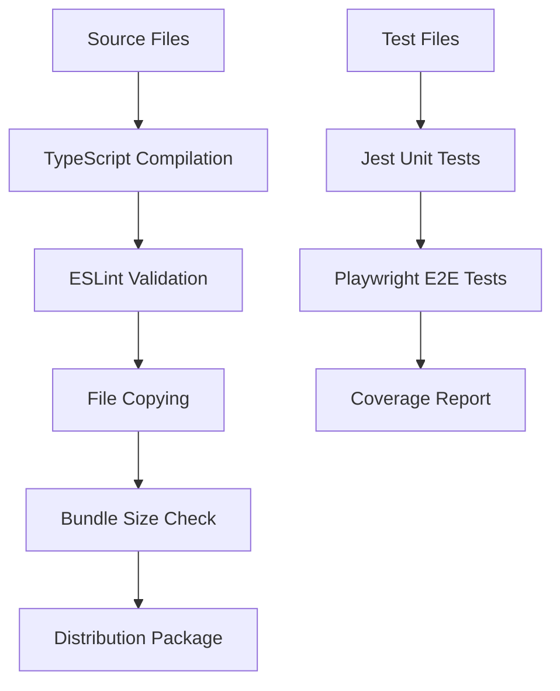

# Qwen Translator Extension - Developer Guide

## Table of Contents

1. [Development Environment Setup](#development-environment-setup)
2. [Project Structure](#project-structure)
3. [Build Process and Tooling](#build-process-and-tooling)
4. [Module Development Guidelines](#module-development-guidelines)
5. [Testing Strategies](#testing-strategies)
6. [Chrome Extension Development](#chrome-extension-development)
7. [Performance Optimization](#performance-optimization)
8. [Debugging and Troubleshooting](#debugging-and-troubleshooting)
9. [Contribution Workflow](#contribution-workflow)

---

## Development Environment Setup

### Prerequisites

Ensure you have the following tools installed:

- **Node.js**: v18.x or later (LTS recommended)
- **npm**: v8.x or later (comes with Node.js)
- **Git**: Latest version
- **Chrome/Chromium**: For testing (any recent version)
- **VSCode**: Recommended IDE with extensions (optional but recommended)

### Initial Setup

```bash
# Clone the repository
git clone https://github.com/your-org/qwen-translator-extension.git
cd qwen-translator-extension

# Install dependencies
npm install

# Fetch WASM assets (automatically runs via postinstall)
# This downloads MuPDF, HarfBuzz, and other WASM modules
npm run postinstall

# Verify installation
npm run typecheck:all
npm test
```

### Environment Configuration

Create a `.env.local` file (not committed to git) for local development:

```bash
# API Keys for testing (optional)
QWEN_API_KEY=your-dashscope-api-key
OPENAI_API_KEY=your-openai-api-key
DEEPL_API_KEY=your-deepl-api-key

# Development settings
DEBUG_LOGGING=true
ENABLE_SOURCE_MAPS=true
SKIP_MINIFICATION=true

# Test configuration
TEST_TIMEOUT=30000
MOCK_API_RESPONSES=false
```

### IDE Setup (VSCode)

Install the recommended extensions for the best development experience:

```json
{
  "recommendations": [
    "ms-vscode.vscode-typescript-next",
    "esbenp.prettier-vscode",
    "ms-vscode.vscode-eslint",
    "bradlc.vscode-tailwindcss",
    "ms-vscode.vscode-json",
    "christian-kohler.path-intellisense",
    "ms-playwright.playwright"
  ]
}
```

VSCode workspace settings (`.vscode/settings.json`):

```json
{
  "typescript.preferences.importModuleSpecifier": "relative",
  "eslint.workingDirectories": ["src", "test", "types"],
  "editor.formatOnSave": true,
  "editor.codeActionsOnSave": {
    "source.fixAll.eslint": true
  },
  "files.associations": {
    "*.js": "javascript",
    "*.ts": "typescript"
  },
  "typescript.suggest.autoImports": true,
  "javascript.suggest.autoImports": true
}
```

---

## Project Structure

### Directory Layout

```
qwen-translator-extension/
├── src/                          # Source code
│   ├── core/                     # Core modules (TypeScript)
│   │   ├── types.ts              # Type definitions
│   │   ├── config-manager.ts     # Configuration management
│   │   ├── cache-manager.js      # Caching system
│   │   ├── throttle-manager.js   # Rate limiting
│   │   ├── logger.js             # Logging system
│   │   ├── error-manager.js      # Error handling
│   │   ├── storage-adapter.js    # Storage abstraction
│   │   ├── wasm-loader.js        # WASM module loading
│   │   └── pdf-loader.js         # PDF processing
│   ├── lib/                      # Shared libraries
│   │   ├── messaging.js          # Message routing
│   │   ├── providers.js          # Provider registry
│   │   ├── tm.js                 # Translation memory
│   │   └── feedback.js           # User feedback
│   ├── providers/                # Translation providers
│   │   ├── qwen.js              # Qwen/DashScope
│   │   ├── openai.js            # OpenAI GPT
│   │   ├── deepl.js             # DeepL
│   │   ├── gemini.js            # Google Gemini
│   │   └── [provider].js        # Other providers
│   ├── popup/                    # Popup interface
│   │   ├── home.js              # Main popup
│   │   ├── settings.js          # Settings panel
│   │   ├── diagnostics.js       # Diagnostic tools
│   │   └── provider-editor.js   # Provider configuration
│   ├── background.js             # Service worker
│   ├── contentScript.js          # Content script
│   ├── popup.js                  # Popup entry point
│   ├── options.js               # Options page
│   ├── translator.js            # Core translation logic
│   ├── config.js                # Configuration utilities
│   ├── manifest.json            # Extension manifest
│   └── styles/                  # CSS themes
├── dist/                        # Built extension files
├── types/                       # TypeScript definitions
├── test/                        # Unit tests
├── e2e/                         # End-to-end tests
├── tools/                       # Build tools
├── docs/                        # Documentation
└── scripts/                     # Build and utility scripts
```

### Core Module Architecture

The extension follows a layered architecture:

```
┌─────────────────────────────────────┐
│             UI Layer                │
│  (Popup, Options, Content Script)   │
├─────────────────────────────────────┤
│           Service Layer             │
│    (Background Worker, Messaging)   │
├─────────────────────────────────────┤
│           Core Modules              │
│  (Config, Cache, Throttle, Logger)  │
├─────────────────────────────────────┤
│          Provider Layer             │
│     (Translation Providers)         │
├─────────────────────────────────────┤
│         Infrastructure              │
│   (Storage, Network, WASM, PDF)     │
└─────────────────────────────────────┘
```

---

## Build Process and Tooling

### Available Scripts

```bash
# Development
npm run build:fast        # Quick build without TypeScript
npm run build             # Full build with TypeScript
npm run typecheck:all     # Type check all files
npm run lint              # ESLint code checking
npm run format            # Prettier code formatting

# Testing
npm test                  # Run unit tests
npm run test:e2e         # Run end-to-end tests
npm run test:e2e-web     # Web-specific E2E tests
npm run test:e2e-pdf     # PDF-specific E2E tests

# Size Analysis
npm run size             # Bundle size analysis
npm run size:analyze     # Interactive bundle analyzer
npm run size:report      # Generate size report JSON

# Extension Building
npm run build:safari     # Convert to Safari extension
npm run zip              # Create extension ZIP
npm run build:zip        # Build and ZIP

# Quality
npm run secrets          # Security scan for secrets
npm run type-check       # Shell script type checker
```

### Build Pipeline

The build process consists of several stages:



#### 1. TypeScript Compilation

Configuration in `tsconfig.build.json`:

```json
{
  "extends": "./tsconfig.json",
  "compilerOptions": {
    "outDir": "dist",
    "declaration": false,
    "sourceMap": false,
    "removeComments": true
  },
  "include": [
    "src/core/**/*.ts",
    "types/**/*.ts"
  ],
  "exclude": [
    "test/**/*",
    "e2e/**/*",
    "**/*.spec.ts",
    "**/*.test.ts"
  ]
}
```

#### 2. Bundle Size Limits

Size limits are enforced via `size-limit` configuration in `package.json`:

```json
{
  "size-limit": [
    {
      "name": "Core translator module",
      "path": "dist/translator.js",
      "limit": "60 KB"
    },
    {
      "name": "Background service worker",
      "path": "dist/background.js",
      "limit": "50 KB"
    },
    {
      "name": "Content script (initial)",
      "path": "dist/contentScript.js",
      "limit": "40 KB"
    },
    {
      "name": "Initial bundle (critical path)",
      "path": ["dist/background.js", "dist/translator.js", "dist/config.js"],
      "limit": "120 KB"
    }
  ]
}
```

#### 3. Asset Management

WASM and large assets are fetched via post-install script:

```bash
# scripts/fetch-wasm-assets.sh
#!/bin/bash
set -e

echo "Fetching WASM assets..."

# MuPDF WASM
curl -L -o src/mupdf.wasm "https://github.com/ArtifexSoftware/mupdf.js/releases/latest/download/mupdf.wasm"
curl -L -o src/mupdf-wasm.js "https://github.com/ArtifexSoftware/mupdf.js/releases/latest/download/mupdf.js"

# HarfBuzz WASM (for text shaping)
curl -L -o src/hb.wasm "https://github.com/harfbuzz/harfbuzzjs/releases/latest/download/hb.wasm"
curl -L -o src/hb.js "https://github.com/harfbuzz/harfbuzzjs/releases/latest/download/hb.js"

echo "WASM assets fetched successfully"
```

---

## Module Development Guidelines

### Core Module Standards

#### 1. Module Template

Every core module should follow this structure:

```javascript
// src/core/example-module.js

/**
 * @fileoverview Example core module following standards
 * @author Qwen Translator Team
 * @version 1.0.0
 */

// Type imports (if using TypeScript)
/// <reference path="../../types/example-module.d.ts" />

// Dependencies
import { Logger } from './logger.js';
import { ConfigManager } from './config-manager.js';

/**
 * Example module demonstrating core module patterns
 * @class ExampleModule
 */
class ExampleModule {
  /**
   * @param {Object} options - Module configuration
   * @param {Logger} options.logger - Logger instance
   * @param {ConfigManager} options.config - Config manager
   */
  constructor(options = {}) {
    this.logger = options.logger || Logger.create('example-module');
    this.config = options.config || ConfigManager.getInstance();
    this.initialized = false;
    
    // Module-specific state
    this.cache = new Map();
    this.metrics = {
      operationsCount: 0,
      errorsCount: 0,
      lastOperation: null
    };
  }
  
  /**
   * Initialize the module
   * @returns {Promise<void>}
   */
  async initialize() {
    if (this.initialized) {
      this.logger.warn('Module already initialized');
      return;
    }
    
    try {
      // Load configuration
      const config = await this.config.get('exampleModule', {
        enabled: true,
        cacheSize: 1000
      });
      
      // Initialize subsystems
      await this.initializeCache(config.cacheSize);
      
      this.initialized = true;
      this.logger.info('Module initialized successfully', {
        cacheSize: config.cacheSize,
        version: '1.0.0'
      });
      
    } catch (error) {
      this.logger.error('Failed to initialize module', error);
      throw error;
    }
  }
  
  /**
   * Primary module operation
   * @param {string} input - Input data
   * @param {Object} options - Operation options
   * @returns {Promise<string>} Processing result
   */
  async processData(input, options = {}) {
    this.ensureInitialized();
    
    const startTime = Date.now();
    const operationId = `${Date.now()}-${Math.random()}`;
    
    try {
      this.logger.debug('Starting data processing', {
        operationId,
        inputLength: input?.length || 0,
        options
      });
      
      // Check cache first
      const cacheKey = this.generateCacheKey(input, options);
      const cached = this.cache.get(cacheKey);
      
      if (cached && !this.isCacheExpired(cached)) {
        this.logger.debug('Returning cached result', { operationId });
        return cached.result;
      }
      
      // Process the data
      const result = await this.performProcessing(input, options);
      
      // Cache the result
      this.cache.set(cacheKey, {
        result,
        timestamp: Date.now(),
        ttl: options.cacheTtl || 300000 // 5 minutes default
      });
      
      // Update metrics
      this.metrics.operationsCount++;
      this.metrics.lastOperation = Date.now();
      
      const duration = Date.now() - startTime;
      this.logger.info('Data processing completed', {
        operationId,
        duration,
        cached: false,
        resultLength: result?.length || 0
      });
      
      return result;
      
    } catch (error) {
      this.metrics.errorsCount++;
      
      this.logger.error('Data processing failed', error, {
        operationId,
        duration: Date.now() - startTime,
        input: input?.substring(0, 100) + '...' // Log first 100 chars only
      });
      
      throw error;
    }
  }
  
  /**
   * Get module statistics
   * @returns {Object} Module metrics
   */
  getStats() {
    return {
      ...this.metrics,
      cacheSize: this.cache.size,
      initialized: this.initialized
    };
  }
  
  /**
   * Cleanup module resources
   * @returns {Promise<void>}
   */
  async cleanup() {
    this.logger.info('Cleaning up module resources');
    
    this.cache.clear();
    this.initialized = false;
    
    // Clean up any timers, connections, etc.
    this.logger.info('Module cleanup completed');
  }
  
  // Private methods
  
  /**
   * @private
   * @param {number} size - Cache size limit
   */
  async initializeCache(size) {
    // Initialize cache with size limits, cleanup timers, etc.
    setInterval(() => {
      this.cleanupExpiredCache();
    }, 60000); // Clean every minute
  }
  
  /**
   * @private
   */
  ensureInitialized() {
    if (!this.initialized) {
      throw new Error('Module not initialized. Call initialize() first.');
    }
  }
  
  /**
   * @private
   * @param {string} input
   * @param {Object} options
   * @returns {string}
   */
  generateCacheKey(input, options) {
    // Create a deterministic cache key
    const hash = this.simpleHash(JSON.stringify({ input, options }));
    return `example_${hash}`;
  }
  
  /**
   * @private
   * @param {Object} cached
   * @returns {boolean}
   */
  isCacheExpired(cached) {
    return Date.now() - cached.timestamp > cached.ttl;
  }
  
  /**
   * @private
   */
  cleanupExpiredCache() {
    const now = Date.now();
    let cleaned = 0;
    
    for (const [key, cached] of this.cache.entries()) {
      if (now - cached.timestamp > cached.ttl) {
        this.cache.delete(key);
        cleaned++;
      }
    }
    
    if (cleaned > 0) {
      this.logger.debug(`Cleaned ${cleaned} expired cache entries`);
    }
  }
  
  /**
   * @private
   * @param {string} str
   * @returns {string}
   */
  simpleHash(str) {
    let hash = 0;
    for (let i = 0; i < str.length; i++) {
      const char = str.charCodeAt(i);
      hash = ((hash << 5) - hash) + char;
      hash = hash & hash; // Convert to 32-bit integer
    }
    return Math.abs(hash).toString(36);
  }
  
  /**
   * @private
   * @param {string} input
   * @param {Object} options
   * @returns {Promise<string>}
   */
  async performProcessing(input, options) {
    // Actual processing logic goes here
    // This is where the module's core functionality is implemented
    
    return `Processed: ${input}`;
  }
}

// Export patterns for different environments
if (typeof module !== 'undefined' && module.exports) {
  module.exports = ExampleModule;
}

if (typeof self !== 'undefined') {
  self.ExampleModule = ExampleModule;
}

export default ExampleModule;
```

#### 2. TypeScript Integration

Create corresponding TypeScript definitions:

```typescript
// types/example-module.d.ts

import { Logger } from './logger';
import { ConfigManager } from './config-manager';

export interface ExampleModuleOptions {
  logger?: Logger;
  config?: ConfigManager;
}

export interface ExampleModuleConfig {
  enabled: boolean;
  cacheSize: number;
}

export interface ExampleModuleMetrics {
  operationsCount: number;
  errorsCount: number;
  lastOperation: number | null;
  cacheSize: number;
  initialized: boolean;
}

export interface ProcessingOptions {
  cacheTtl?: number;
  timeout?: number;
  [key: string]: any;
}

export class ExampleModule {
  constructor(options?: ExampleModuleOptions);
  
  initialize(): Promise<void>;
  processData(input: string, options?: ProcessingOptions): Promise<string>;
  getStats(): ExampleModuleMetrics;
  cleanup(): Promise<void>;
}

declare global {
  interface Window {
    ExampleModule: typeof ExampleModule;
  }
}
```

### Provider Development

#### Provider Interface Implementation

```javascript
// src/providers/custom-provider.js

/**
 * Custom translation provider implementation
 * @implements {ITranslationProvider}
 */
class CustomTranslationProvider {
  constructor(config) {
    this.id = 'custom-provider';
    this.name = 'Custom Translation Service';
    this.config = config;
    this.logger = qwenLogger?.create(`provider:${this.id}`) || console;
  }
  
  /**
   * Translate text using the custom provider
   * @param {TranslationRequest} request
   * @returns {Promise<TranslationResult>}
   */
  async translate(request) {
    const { text, sourceLanguage, targetLanguage } = request;
    const startTime = Date.now();
    
    try {
      this.validateRequest(request);
      
      // Make API request
      const response = await fetch(`${this.config.apiEndpoint}/translate`, {
        method: 'POST',
        headers: {
          'Authorization': `Bearer ${this.config.apiKey}`,
          'Content-Type': 'application/json',
          'User-Agent': 'QwenTranslator/1.0'
        },
        body: JSON.stringify({
          text,
          source_language: sourceLanguage,
          target_language: targetLanguage,
          model: this.config.model
        })
      });
      
      if (!response.ok) {
        throw new Error(`API request failed: ${response.status} ${response.statusText}`);
      }
      
      const data = await response.json();
      
      return {
        translatedText: data.translation,
        sourceLanguage: data.detected_language || sourceLanguage,
        targetLanguage,
        provider: this.id,
        model: this.config.model,
        tokensUsed: data.usage?.tokens || 0,
        duration: Date.now() - startTime,
        confidence: data.confidence || 0.8,
        cached: false,
        metadata: {
          requestId: data.request_id,
          cost: data.usage?.cost || 0
        }
      };
      
    } catch (error) {
      this.logger.error('Translation failed', error, {
        provider: this.id,
        textLength: text.length,
        duration: Date.now() - startTime
      });
      
      throw this.handleError(error);
    }
  }
  
  /**
   * Detect the language of input text
   * @param {string} text
   * @returns {Promise<string>}
   */
  async detectLanguage(text) {
    // Implementation for language detection
    const response = await fetch(`${this.config.apiEndpoint}/detect`, {
      method: 'POST',
      headers: {
        'Authorization': `Bearer ${this.config.apiKey}`,
        'Content-Type': 'application/json'
      },
      body: JSON.stringify({ text })
    });
    
    if (!response.ok) {
      throw new Error(`Language detection failed: ${response.status}`);
    }
    
    const data = await response.json();
    return data.language || 'auto';
  }
  
  /**
   * Get supported languages
   * @returns {Promise<Language[]>}
   */
  async getSupportedLanguages() {
    const response = await fetch(`${this.config.apiEndpoint}/languages`, {
      headers: {
        'Authorization': `Bearer ${this.config.apiKey}`
      }
    });
    
    if (!response.ok) {
      // Return fallback list if API fails
      return [
        { code: 'en', name: 'English' },
        { code: 'es', name: 'Spanish' },
        { code: 'fr', name: 'French' },
        { code: 'de', name: 'German' }
      ];
    }
    
    const data = await response.json();
    return data.languages;
  }
  
  /**
   * Validate provider configuration
   * @param {ProviderConfig} config
   * @returns {ValidationResult}
   */
  validateConfig(config) {
    const errors = [];
    const warnings = [];
    
    if (!config.apiKey) {
      errors.push('API key is required');
    } else if (config.apiKey.length < 10) {
      warnings.push('API key seems too short');
    }
    
    if (!config.apiEndpoint) {
      errors.push('API endpoint is required');
    } else if (!config.apiEndpoint.startsWith('https://')) {
      warnings.push('API endpoint should use HTTPS');
    }
    
    if (!config.model) {
      warnings.push('No model specified, will use default');
    }
    
    return {
      valid: errors.length === 0,
      errors,
      warnings
    };
  }
  
  /**
   * @private
   * @param {TranslationRequest} request
   */
  validateRequest(request) {
    if (!request.text || request.text.trim().length === 0) {
      throw new Error('Text is required for translation');
    }
    
    if (request.text.length > this.config.charLimit) {
      throw new Error(`Text too long. Maximum ${this.config.charLimit} characters allowed`);
    }
    
    if (!request.targetLanguage) {
      throw new Error('Target language is required');
    }
  }
  
  /**
   * @private
   * @param {Error} error
   * @returns {Error}
   */
  handleError(error) {
    // Map provider-specific errors to standard error codes
    if (error.message.includes('401') || error.message.includes('403')) {
      error.code = 'PROVIDER_AUTH_FAILED';
    } else if (error.message.includes('429')) {
      error.code = 'PROVIDER_QUOTA_EXCEEDED';
    } else if (error.message.includes('timeout')) {
      error.code = 'TIMEOUT_ERROR';
    } else {
      error.code = 'PROVIDER_ERROR';
    }
    
    return error;
  }
}

// Export for different environments
if (typeof module !== 'undefined' && module.exports) {
  module.exports = CustomTranslationProvider;
}

if (typeof self !== 'undefined') {
  self.CustomTranslationProvider = CustomTranslationProvider;
}
```

---

## Testing Strategies

### Unit Testing with Jest

#### Test Setup

Configuration in `jest.config.js`:

```javascript
module.exports = {
  testEnvironment: 'jsdom',
  setupFilesAfterEnv: ['<rootDir>/jest.setup.js'],
  testMatch: [
    '<rootDir>/test/**/*.test.js',
    '<rootDir>/test/**/*.spec.js'
  ],
  collectCoverageFrom: [
    'src/**/*.js',
    '!src/**/*.min.js',
    '!src/pdf.*.js',
    '!src/mupdf*.js',
    '!src/hb*.js'
  ],
  coverageReporters: ['text', 'lcov', 'html'],
  coverageThreshold: {
    global: {
      branches: 70,
      functions: 80,
      lines: 80,
      statements: 80
    }
  },
  moduleNameMapping: {
    '^@/(.*)$': '<rootDir>/src/$1',
    '^@test/(.*)$': '<rootDir>/test/$1'
  }
};
```

#### Example Unit Tests

```javascript
// test/core/config-manager.test.js

import { ConfigManager } from '../../src/core/config-manager';
import { jest } from '@jest/globals';

describe('ConfigManager', () => {
  let configManager;
  let mockStorage;
  
  beforeEach(() => {
    // Mock Chrome storage API
    mockStorage = {
      sync: {
        get: jest.fn(),
        set: jest.fn(),
        clear: jest.fn()
      },
      local: {
        get: jest.fn(),
        set: jest.fn(),
        clear: jest.fn()
      }
    };
    
    global.chrome = {
      storage: mockStorage,
      runtime: {
        lastError: null
      }
    };
    
    configManager = new ConfigManager();
  });
  
  afterEach(() => {
    jest.clearAllMocks();
  });
  
  describe('get()', () => {
    it('should return default value when key does not exist', async () => {
      mockStorage.sync.get.mockImplementation((keys, callback) => {
        callback({});
      });
      
      const result = await configManager.get('nonexistent', 'default');
      expect(result).toBe('default');
    });
    
    it('should return stored value when key exists', async () => {
      const testValue = { apiKey: 'test-key', enabled: true };
      mockStorage.sync.get.mockImplementation((keys, callback) => {
        callback({ testKey: testValue });
      });
      
      const result = await configManager.get('testKey');
      expect(result).toEqual(testValue);
    });
    
    it('should handle storage errors gracefully', async () => {
      global.chrome.runtime.lastError = new Error('Storage error');
      
      await expect(configManager.get('key')).rejects.toThrow('Storage error');
    });
  });
  
  describe('set()', () => {
    it('should encrypt sensitive data', async () => {
      const apiKey = 'sk-test123456';
      mockStorage.sync.set.mockImplementation((data, callback) => {
        // Verify that API key is encrypted
        expect(data.apiKey).not.toBe(apiKey);
        expect(data.apiKey).toMatch(/^encrypted:/);
        callback();
      });
      
      await configManager.set('apiKey', apiKey);
      expect(mockStorage.sync.set).toHaveBeenCalled();
    });
    
    it('should store non-sensitive data as plaintext', async () => {
      const preference = { theme: 'dark', language: 'en' };
      mockStorage.sync.set.mockImplementation((data, callback) => {
        expect(data.preferences).toEqual(preference);
        callback();
      });
      
      await configManager.set('preferences', preference);
      expect(mockStorage.sync.set).toHaveBeenCalled();
    });
  });
  
  describe('validate()', () => {
    it('should validate complete configuration', () => {
      const validConfig = {
        apiKey: 'sk-valid-key',
        activeProvider: 'qwen',
        providers: {
          qwen: {
            id: 'qwen',
            enabled: true,
            apiKey: 'test-key'
          }
        }
      };
      
      const result = configManager.validate(validConfig);
      expect(result.valid).toBe(true);
      expect(result.errors).toHaveLength(0);
    });
    
    it('should detect missing required fields', () => {
      const invalidConfig = {
        activeProvider: 'qwen'
        // Missing apiKey, providers
      };
      
      const result = configManager.validate(invalidConfig);
      expect(result.valid).toBe(false);
      expect(result.errors).toContain('API key is required');
      expect(result.errors).toContain('At least one provider must be configured');
    });
  });
});
```

#### Provider Testing

```javascript
// test/providers/qwen.test.js

import QwenProvider from '../../src/providers/qwen';
import fetchMock from 'jest-fetch-mock';

describe('QwenProvider', () => {
  let provider;
  
  beforeEach(() => {
    fetchMock.enableMocks();
    fetchMock.resetMocks();
    
    provider = new QwenProvider({
      apiKey: 'test-api-key',
      apiEndpoint: 'https://dashscope.aliyuncs.com/compatible-mode/v1',
      model: 'qwen-mt-turbo'
    });
  });
  
  afterEach(() => {
    fetchMock.disableMocks();
  });
  
  describe('translate()', () => {
    it('should translate text successfully', async () => {
      const mockResponse = {
        choices: [{
          message: {
            content: 'Hola mundo'
          }
        }],
        usage: {
          total_tokens: 15
        }
      };
      
      fetchMock.mockResponseOnce(JSON.stringify(mockResponse));
      
      const request = {
        text: 'Hello world',
        sourceLanguage: 'en',
        targetLanguage: 'es'
      };
      
      const result = await provider.translate(request);
      
      expect(result.translatedText).toBe('Hola mundo');
      expect(result.provider).toBe('qwen');
      expect(result.tokensUsed).toBe(15);
      expect(result.sourceLanguage).toBe('en');
      expect(result.targetLanguage).toBe('es');
    });
    
    it('should handle API errors', async () => {
      fetchMock.mockRejectOnce(new Error('Network error'));
      
      const request = {
        text: 'Hello world',
        sourceLanguage: 'en',
        targetLanguage: 'es'
      };
      
      await expect(provider.translate(request)).rejects.toThrow('Network error');
    });
    
    it('should handle quota exceeded errors', async () => {
      fetchMock.mockResponseOnce('', { status: 429 });
      
      const request = {
        text: 'Hello world',
        sourceLanguage: 'en',
        targetLanguage: 'es'
      };
      
      await expect(provider.translate(request)).rejects.toThrow();
    });
  });
});
```

### End-to-End Testing with Playwright

#### E2E Test Setup

Configuration in `playwright.config.js`:

```javascript
import { defineConfig, devices } from '@playwright/test';

export default defineConfig({
  testDir: './e2e',
  fullyParallel: true,
  forbidOnly: !!process.env.CI,
  retries: process.env.CI ? 2 : 0,
  workers: process.env.CI ? 1 : undefined,
  reporter: 'html',
  use: {
    baseURL: 'http://localhost:8080',
    trace: 'on-first-retry',
    screenshot: 'only-on-failure'
  },
  projects: [
    {
      name: 'chromium',
      use: { ...devices['Desktop Chrome'] }
    },
    {
      name: 'webkit',
      use: { ...devices['Desktop Safari'] }
    }
  ],
  webServer: {
    command: 'npm run serve',
    port: 8080,
    reuseExistingServer: !process.env.CI
  }
});
```

#### Extension Testing

```javascript
// e2e/extension-workflow.spec.js

import { test, expect } from '@playwright/test';
import { readFile } from 'fs/promises';
import path from 'path';

test.describe('Extension Workflow', () => {
  let extensionId;
  
  test.beforeAll(async ({ browser }) => {
    // Load extension
    const pathToExtension = path.resolve('./dist');
    const context = await browser.newContext({
      args: [
        `--disable-extensions-except=${pathToExtension}`,
        `--load-extension=${pathToExtension}`
      ]
    });
    
    // Get extension ID
    const page = await context.newPage();
    await page.goto('chrome://extensions/');
    const extensions = await page.locator('.extension-list-item').all();
    
    for (const ext of extensions) {
      const name = await ext.locator('.extension-name').textContent();
      if (name.includes('Qwen Translator')) {
        extensionId = await ext.getAttribute('id');
        break;
      }
    }
  });
  
  test('should open popup and display providers', async ({ page }) => {
    // Navigate to extension popup
    await page.goto(`chrome-extension://${extensionId}/popup.html`);
    
    // Check that popup loads
    await expect(page.locator('h1')).toContainText('Qwen Translator');
    
    // Check provider grid
    const providerCards = page.locator('.provider-card');
    await expect(providerCards).toHaveCount.greaterThan(0);
    
    // Check language selectors
    const sourceSelect = page.locator('#source-language');
    const targetSelect = page.locator('#target-language');
    
    await expect(sourceSelect).toBeVisible();
    await expect(targetSelect).toBeVisible();
    
    // Verify default selections
    expect(await sourceSelect.inputValue()).toBe('auto');
    expect(await targetSelect.inputValue()).toBe('en');
  });
  
  test('should configure provider and save settings', async ({ page }) => {
    await page.goto(`chrome-extension://${extensionId}/options.html`);
    
    // Wait for options page to load
    await expect(page.locator('h1')).toContainText('Settings');
    
    // Configure Qwen provider
    const qwenTab = page.locator('[data-provider="qwen"]');
    await qwenTab.click();
    
    // Fill in API key
    const apiKeyInput = page.locator('#qwen-api-key');
    await apiKeyInput.fill('sk-test-api-key');
    
    // Enable provider
    const enabledCheckbox = page.locator('#qwen-enabled');
    await enabledCheckbox.check();
    
    // Save settings
    const saveButton = page.locator('#save-settings');
    await saveButton.click();
    
    // Verify success message
    await expect(page.locator('.success-message')).toBeVisible();
    await expect(page.locator('.success-message')).toContainText('Settings saved');
  });
  
  test('should translate page content', async ({ page, context }) => {
    // Create a test page with content to translate
    const testPage = await context.newPage();
    await testPage.setContent(`
      <html>
        <head><title>Test Page</title></head>
        <body>
          <h1>Welcome to our website</h1>
          <p>This is a test paragraph that should be translated.</p>
          <button>Click here</button>
        </body>
      </html>
    `);
    
    // Inject content script (simulating extension injection)
    await testPage.addScriptTag({
      path: './dist/contentScript.js'
    });
    
    // Trigger translation
    await testPage.evaluate(() => {
      window.postMessage({
        action: 'translatePage',
        sourceLanguage: 'en',
        targetLanguage: 'es',
        provider: 'qwen'
      }, '*');
    });
    
    // Wait for translation to complete
    await testPage.waitForFunction(() => {
      return document.querySelector('[data-translated="true"]') !== null;
    });
    
    // Verify that elements were translated
    const translatedElements = await testPage.locator('[data-translated="true"]').count();
    expect(translatedElements).toBeGreaterThan(0);
    
    // Check specific translations (would require mock API responses)
    const heading = testPage.locator('h1');
    const headingText = await heading.textContent();
    expect(headingText).not.toBe('Welcome to our website');
  });
});
```

#### PDF Translation Testing

```javascript
// e2e/pdf-translation.spec.js

import { test, expect } from '@playwright/test';
import { PDFDocument, rgb } from 'pdf-lib';
import { writeFile } from 'fs/promises';

test.describe('PDF Translation', () => {
  test.beforeAll(async () => {
    // Create a test PDF
    const pdfDoc = await PDFDocument.create();
    const page = pdfDoc.addPage();
    
    page.drawText('Hello World', {
      x: 50,
      y: 700,
      color: rgb(0, 0, 0)
    });
    
    page.drawText('This is a test document for translation.', {
      x: 50,
      y: 650,
      color: rgb(0, 0, 0)
    });
    
    const pdfBytes = await pdfDoc.save();
    await writeFile('./e2e/fixtures/test.pdf', pdfBytes);
  });
  
  test('should intercept and redirect PDF URLs', async ({ page }) => {
    // Navigate to PDF
    const pdfUrl = 'file://' + path.resolve('./e2e/fixtures/test.pdf');
    await page.goto(pdfUrl);
    
    // Should be redirected to custom PDF viewer
    await expect(page).toHaveURL(/pdfViewer\.html/);
    
    // Wait for PDF to load
    await expect(page.locator('#pdf-canvas')).toBeVisible();
    
    // Verify PDF content is rendered
    const canvas = page.locator('#pdf-canvas');
    await expect(canvas).toHaveAttribute('width');
    await expect(canvas).toHaveAttribute('height');
  });
  
  test('should translate PDF text content', async ({ page }) => {
    // Load PDF viewer directly
    await page.goto(`chrome-extension://${extensionId}/pdfViewer.html`);
    
    // Load test PDF
    const pdfPath = path.resolve('./e2e/fixtures/test.pdf');
    await page.setInputFiles('#pdf-file-input', pdfPath);
    
    // Wait for PDF processing
    await expect(page.locator('#pdf-canvas')).toBeVisible();
    
    // Trigger translation
    await page.click('#translate-button');
    
    // Configure translation
    await page.selectOption('#source-language', 'en');
    await page.selectOption('#target-language', 'es');
    
    // Start translation
    await page.click('#start-translation');
    
    // Wait for translation overlay
    await expect(page.locator('.translation-overlay')).toBeVisible();
    
    // Verify translated text appears
    const translatedText = page.locator('.translated-text');
    await expect(translatedText.first()).toBeVisible();
    
    // Check that translation is different from original
    const originalText = 'Hello World';
    const translationContent = await translatedText.first().textContent();
    expect(translationContent).not.toBe(originalText);
    expect(translationContent.length).toBeGreaterThan(0);
  });
});
```

---

## Chrome Extension Development

### Manifest V3 Configuration

The extension uses Manifest V3 for modern Chrome compatibility:

```json
{
  "manifest_version": 3,
  "name": "Qwen Translator",
  "version": "1.44.1",
  "description": "AI-powered translation for web pages and PDFs",
  
  "permissions": [
    "storage",
    "activeTab",
    "scripting",
    "webRequest"
  ],
  
  "host_permissions": [
    "<all_urls>"
  ],
  
  "background": {
    "service_worker": "background.js",
    "type": "module"
  },
  
  "content_scripts": [{
    "matches": ["<all_urls>"],
    "js": ["contentScript.js"],
    "run_at": "document_end",
    "all_frames": true
  }],
  
  "action": {
    "default_popup": "popup.html",
    "default_title": "Translate Page"
  },
  
  "options_ui": {
    "page": "options.html",
    "open_in_tab": true
  },
  
  "web_accessible_resources": [{
    "resources": [
      "pdfViewer.html",
      "pdf.min.js",
      "pdf.worker.min.js",
      "styles/*.css"
    ],
    "matches": ["<all_urls>"]
  }],
  
  "content_security_policy": {
    "extension_pages": "script-src 'self' 'wasm-unsafe-eval'; object-src 'none';"
  }
}
```

### Service Worker (Background Script)

Key considerations for Service Worker development:

```javascript
// src/background.js

// Service workers have no DOM access and limited lifetime
// Use chrome.storage for persistence
// Handle extension lifecycle events

// Import scripts (must be at top level)
importScripts(
  'lib/logger.js',
  'lib/providers.js', 
  'lib/messaging.js',
  'config.js',
  'translator.js'
);

// Service worker activation
chrome.runtime.onStartup.addListener(async () => {
  console.log('Extension startup');
  await initializeExtension();
});

chrome.runtime.onInstalled.addListener(async (details) => {
  console.log('Extension installed/updated', details.reason);
  
  if (details.reason === 'install') {
    await setupDefaultConfiguration();
  } else if (details.reason === 'update') {
    await migrateConfiguration(details.previousVersion);
  }
});

// Message handling
chrome.runtime.onMessage.addListener((message, sender, sendResponse) => {
  handleMessage(message, sender)
    .then(response => sendResponse({ success: true, data: response }))
    .catch(error => sendResponse({ success: false, error: error.message }));
  
  return true; // Keep message channel open for async response
});

// Tab updates for PDF interception
chrome.webRequest.onBeforeRequest.addListener(
  (details) => {
    if (details.url.includes('.pdf')) {
      return {
        redirectUrl: chrome.runtime.getURL(
          `pdfViewer.html?url=${encodeURIComponent(details.url)}`
        )
      };
    }
  },
  { urls: ["<all_urls>"] },
  ["blocking"]
);

// Periodic maintenance (Service Workers can be terminated)
chrome.alarms.onAlarm.addListener((alarm) => {
  if (alarm.name === 'cache-cleanup') {
    performCacheCleanup();
  } else if (alarm.name === 'usage-reset') {
    resetUsageCounters();
  }
});

// Set up recurring alarms
chrome.alarms.create('cache-cleanup', { delayInMinutes: 60, periodInMinutes: 60 });
chrome.alarms.create('usage-reset', { delayInMinutes: 1440, periodInMinutes: 1440 }); // Daily
```

### Content Script Development

Content scripts run in the page context but with limited access:

```javascript
// src/contentScript.js

// Content script runs in isolated world
// Can access DOM but not page JavaScript variables
// Must use chrome.runtime.sendMessage to communicate with background

class PageTranslator {
  constructor() {
    this.translatedNodes = new WeakSet();
    this.observer = null;
    this.batchSize = 50; // Nodes per batch
    this.isTranslating = false;
  }
  
  async initialize() {
    // Listen for translation requests
    chrome.runtime.onMessage.addListener((message, sender, sendResponse) => {
      if (message.action === 'translatePage') {
        this.translatePage(message)
          .then(() => sendResponse({ success: true }))
          .catch(error => sendResponse({ success: false, error: error.message }));
        return true;
      }
    });
    
    // Set up DOM monitoring
    this.setupDOMObserver();
  }
  
  async translatePage({ sourceLanguage, targetLanguage, provider }) {
    if (this.isTranslating) {
      throw new Error('Translation already in progress');
    }
    
    this.isTranslating = true;
    
    try {
      // Find all text nodes
      const textNodes = this.findTranslatableTextNodes();
      console.log(`Found ${textNodes.length} translatable text nodes`);
      
      // Process in batches
      const batches = this.createBatches(textNodes, this.batchSize);
      
      for (let i = 0; i < batches.length; i++) {
        const batch = batches[i];
        console.log(`Processing batch ${i + 1}/${batches.length}`);
        
        try {
          const texts = batch.map(node => node.textContent.trim());
          
          // Send batch to background for translation
          const response = await chrome.runtime.sendMessage({
            action: 'batchTranslate',
            data: {
              texts,
              sourceLanguage,
              targetLanguage,
              provider
            }
          });
          
          if (response.success) {
            this.applyTranslations(batch, response.data.translations);
          } else {
            console.error('Batch translation failed:', response.error);
          }
          
        } catch (error) {
          console.error(`Error processing batch ${i + 1}:`, error);
        }
      }
      
    } finally {
      this.isTranslating = false;
    }
  }
  
  findTranslatableTextNodes() {
    const walker = document.createTreeWalker(
      document.body,
      NodeFilter.SHOW_TEXT,
      {
        acceptNode: (node) => {
          // Skip already translated nodes
          if (this.translatedNodes.has(node)) {
            return NodeFilter.FILTER_REJECT;
          }
          
          // Skip empty or whitespace-only nodes
          const text = node.textContent.trim();
          if (!text || text.length < 3) {
            return NodeFilter.FILTER_REJECT;
          }
          
          // Skip script, style, and other non-content elements
          const parent = node.parentElement;
          if (!parent) return NodeFilter.FILTER_REJECT;
          
          const tagName = parent.tagName.toLowerCase();
          if (['script', 'style', 'noscript', 'template'].includes(tagName)) {
            return NodeFilter.FILTER_REJECT;
          }
          
          // Check if element is visible
          const style = window.getComputedStyle(parent);
          if (style.display === 'none' || style.visibility === 'hidden') {
            return NodeFilter.FILTER_REJECT;
          }
          
          return NodeFilter.FILTER_ACCEPT;
        }
      }
    );
    
    const textNodes = [];
    let node;
    while (node = walker.nextNode()) {
      textNodes.push(node);
    }
    
    return textNodes;
  }
  
  createBatches(nodes, batchSize) {
    const batches = [];
    for (let i = 0; i < nodes.length; i += batchSize) {
      batches.push(nodes.slice(i, i + batchSize));
    }
    return batches;
  }
  
  applyTranslations(nodes, translations) {
    nodes.forEach((node, index) => {
      if (translations[index] && translations[index].translatedText) {
        const originalText = node.textContent;
        const translatedText = translations[index].translatedText;
        
        // Preserve whitespace structure
        const preservedWhitespace = this.preserveWhitespace(originalText, translatedText);
        
        // Update node content
        node.textContent = preservedWhitespace;
        
        // Mark as translated
        this.translatedNodes.add(node);
        
        // Add visual indicator
        if (node.parentElement) {
          node.parentElement.setAttribute('data-translated', 'true');
          node.parentElement.title = `Original: ${originalText}`;
        }
      }
    });
  }
  
  preserveWhitespace(original, translated) {
    // Preserve leading whitespace
    const leadingWhitespace = original.match(/^\s*/)[0];
    const trailingWhitespace = original.match(/\s*$/)[0];
    
    return leadingWhitespace + translated.trim() + trailingWhitespace;
  }
  
  setupDOMObserver() {
    this.observer = new MutationObserver((mutations) => {
      let hasNewContent = false;
      
      mutations.forEach((mutation) => {
        if (mutation.type === 'childList' && mutation.addedNodes.length > 0) {
          // Check if any new text nodes were added
          mutation.addedNodes.forEach((node) => {
            if (node.nodeType === Node.TEXT_NODE || 
                (node.nodeType === Node.ELEMENT_NODE && node.querySelector)) {
              hasNewContent = true;
            }
          });
        }
      });
      
      // Debounced auto-translation for new content
      if (hasNewContent) {
        this.debounceAutoTranslate();
      }
    });
    
    this.observer.observe(document.body, {
      childList: true,
      subtree: true
    });
  }
  
  debounceAutoTranslate = this.debounce(() => {
    // Check if auto-translation is enabled
    chrome.storage.local.get(['autoTranslate', 'sourceLanguage', 'targetLanguage'], (result) => {
      if (result.autoTranslate && !this.isTranslating) {
        this.translatePage({
          sourceLanguage: result.sourceLanguage || 'auto',
          targetLanguage: result.targetLanguage || 'en',
          provider: 'qwen' // Default provider
        });
      }
    });
  }, 2000);
  
  debounce(func, wait) {
    let timeout;
    return function executedFunction(...args) {
      const later = () => {
        clearTimeout(timeout);
        func(...args);
      };
      clearTimeout(timeout);
      timeout = setTimeout(later, wait);
    };
  }
}

// Initialize content script
const pageTranslator = new PageTranslator();
pageTranslator.initialize();
```

---

## Performance Optimization

### Bundle Size Management

Monitor and optimize bundle sizes using the configured limits:

```bash
# Check current bundle sizes
npm run size

# Analyze bundle composition
npm run size:analyze

# Generate size report
npm run size:report
```

### Lazy Loading Implementation

```javascript
// src/core/module-loader.js

/**
 * Dynamic module loader for lazy loading heavy components
 */
class ModuleLoader {
  constructor() {
    this.loadedModules = new Map();
    this.loadingPromises = new Map();
  }
  
  /**
   * Load a module dynamically
   * @param {string} moduleName - Module identifier
   * @param {string} modulePath - Path to module file
   * @returns {Promise<any>} Module exports
   */
  async loadModule(moduleName, modulePath) {
    // Return already loaded module
    if (this.loadedModules.has(moduleName)) {
      return this.loadedModules.get(moduleName);
    }
    
    // Return existing loading promise
    if (this.loadingPromises.has(moduleName)) {
      return await this.loadingPromises.get(moduleName);
    }
    
    // Start loading
    const loadingPromise = this.performLoad(moduleName, modulePath);
    this.loadingPromises.set(moduleName, loadingPromise);
    
    try {
      const module = await loadingPromise;
      this.loadedModules.set(moduleName, module);
      this.loadingPromises.delete(moduleName);
      return module;
      
    } catch (error) {
      this.loadingPromises.delete(moduleName);
      throw error;
    }
  }
  
  async performLoad(moduleName, modulePath) {
    const startTime = performance.now();
    
    try {
      // Load via dynamic import in modern environments
      if (typeof import === 'function') {
        const module = await import(modulePath);
        this.logLoadTime(moduleName, startTime);
        return module;
      }
      
      // Fallback to script injection for extension contexts
      return await this.loadViaScript(modulePath);
      
    } catch (error) {
      console.error(`Failed to load module ${moduleName}:`, error);
      throw error;
    }
  }
  
  loadViaScript(scriptPath) {
    return new Promise((resolve, reject) => {
      const script = document.createElement('script');
      script.src = chrome.runtime.getURL(scriptPath);
      script.onload = () => {
        // Module should export to global scope or self
        const module = self[scriptPath.replace(/[^a-zA-Z0-9]/g, '')] || {};
        resolve(module);
      };
      script.onerror = reject;
      document.head.appendChild(script);
    });
  }
  
  logLoadTime(moduleName, startTime) {
    const duration = performance.now() - startTime;
    console.log(`Module ${moduleName} loaded in ${duration.toFixed(2)}ms`);
    
    // Log slow loads
    if (duration > 1000) {
      console.warn(`Slow module load: ${moduleName} took ${duration.toFixed(2)}ms`);
    }
  }
  
  /**
   * Preload modules that will likely be needed
   * @param {string[]} moduleNames - Modules to preload
   */
  async preloadModules(moduleNames) {
    const preloadPromises = moduleNames.map(name => {
      const path = this.getModulePath(name);
      return this.loadModule(name, path).catch(error => {
        console.warn(`Failed to preload ${name}:`, error);
      });
    });
    
    await Promise.allSettled(preloadPromises);
  }
  
  getModulePath(moduleName) {
    const modulePaths = {
      'pdf-processor': 'core/pdf-loader.js',
      'wasm-engines': 'core/wasm-loader.js',
      'advanced-ui': 'popup/advanced-ui.js',
      'diagnostics': 'popup/diagnostics.js',
      'provider-editor': 'popup/provider-editor.js'
    };
    
    return modulePaths[moduleName] || `${moduleName}.js`;
  }
}

// Global instance
const moduleLoader = new ModuleLoader();

// Usage examples
async function loadPDFProcessor() {
  const pdfModule = await moduleLoader.loadModule('pdf-processor', 'core/pdf-loader.js');
  return new pdfModule.PDFProcessor();
}

async function loadWASMEngines() {
  const wasmModule = await moduleLoader.loadModule('wasm-engines', 'core/wasm-loader.js');
  return wasmModule;
}

export default moduleLoader;
```

### Memory Management

```javascript
// Memory-efficient cache implementation
class MemoryEfficientCache {
  constructor(options = {}) {
    this.maxSize = options.maxSize || 1000;
    this.maxMemory = options.maxMemory || 50 * 1024 * 1024; // 50MB
    this.cache = new Map();
    this.accessCounts = new Map();
    this.memoryUsage = 0;
    
    // Cleanup interval
    setInterval(() => this.cleanup(), 30000);
  }
  
  set(key, value, metadata = {}) {
    const entry = {
      value,
      timestamp: Date.now(),
      accessCount: 0,
      size: this.estimateSize(value),
      ...metadata
    };
    
    // Check if we need to evict entries
    this.ensureSpace(entry.size);
    
    this.cache.set(key, entry);
    this.accessCounts.set(key, 0);
    this.memoryUsage += entry.size;
  }
  
  get(key) {
    const entry = this.cache.get(key);
    if (!entry) return null;
    
    // Update access statistics
    entry.accessCount++;
    this.accessCounts.set(key, entry.accessCount);
    entry.timestamp = Date.now();
    
    return entry.value;
  }
  
  ensureSpace(neededSize) {
    while ((this.cache.size >= this.maxSize) || 
           (this.memoryUsage + neededSize > this.maxMemory)) {
      
      if (this.cache.size === 0) break;
      
      // Find least frequently used entry
      let leastUsedKey = null;
      let leastUsedCount = Infinity;
      
      for (const [key, count] of this.accessCounts) {
        if (count < leastUsedCount) {
          leastUsedCount = count;
          leastUsedKey = key;
        }
      }
      
      if (leastUsedKey) {
        this.delete(leastUsedKey);
      } else {
        break;
      }
    }
  }
  
  delete(key) {
    const entry = this.cache.get(key);
    if (entry) {
      this.cache.delete(key);
      this.accessCounts.delete(key);
      this.memoryUsage -= entry.size;
      return true;
    }
    return false;
  }
  
  cleanup() {
    const now = Date.now();
    const expiredKeys = [];
    
    for (const [key, entry] of this.cache) {
      const age = now - entry.timestamp;
      const ttl = entry.ttl || 300000; // 5 minutes default
      
      if (age > ttl) {
        expiredKeys.push(key);
      }
    }
    
    for (const key of expiredKeys) {
      this.delete(key);
    }
    
    if (expiredKeys.length > 0) {
      console.log(`Cleaned up ${expiredKeys.length} expired cache entries`);
    }
  }
  
  estimateSize(value) {
    if (typeof value === 'string') {
      return value.length * 2; // Assume UTF-16
    } else if (typeof value === 'object') {
      return JSON.stringify(value).length * 2;
    }
    return 64; // Default estimate
  }
  
  getStats() {
    return {
      size: this.cache.size,
      maxSize: this.maxSize,
      memoryUsage: this.memoryUsage,
      maxMemory: this.maxMemory,
      utilizationPercent: (this.memoryUsage / this.maxMemory) * 100
    };
  }
}
```

---

## Debugging and Troubleshooting

### Development Tools Setup

#### Extension Debugging

```javascript
// src/lib/debug.js

/**
 * Debug utilities for development
 */
const Debug = {
  enabled: false,
  
  init() {
    // Enable debugging in development
    this.enabled = !chrome.runtime.getManifest().manifest_version || 
                   localStorage.getItem('debug') === 'true';
    
    if (this.enabled) {
      console.log('Debug mode enabled');
      this.setupConsoleHelpers();
    }
  },
  
  log(...args) {
    if (this.enabled) {
      console.log('[DEBUG]', ...args);
    }
  },
  
  error(...args) {
    if (this.enabled) {
      console.error('[DEBUG]', ...args);
    }
  },
  
  setupConsoleHelpers() {
    // Global helpers for console debugging
    window.debugExtension = {
      getConfig: () => configManager.getAll(),
      clearCache: () => cacheManager.clear(),
      testProvider: (id) => this.testProvider(id),
      showMetrics: () => this.showMetrics(),
      exportLogs: () => this.exportLogs()
    };
  },
  
  async testProvider(providerId) {
    try {
      const provider = providerRegistry.get(providerId);
      if (!provider) {
        throw new Error(`Provider ${providerId} not found`);
      }
      
      const result = await provider.translate({
        text: 'Hello world',
        sourceLanguage: 'en',
        targetLanguage: 'es'
      });
      
      console.table({
        Provider: result.provider,
        Translation: result.translatedText,
        Duration: result.duration + 'ms',
        Tokens: result.tokensUsed,
        Confidence: result.confidence
      });
      
      return result;
      
    } catch (error) {
      console.error('Provider test failed:', error);
      throw error;
    }
  },
  
  async showMetrics() {
    const metrics = await metricsCollector.getUsage();
    console.table(metrics);
    return metrics;
  },
  
  async exportLogs() {
    const logs = await logger.getLogs();
    const blob = new Blob([JSON.stringify(logs, null, 2)], { type: 'application/json' });
    const url = URL.createObjectURL(blob);
    
    const a = document.createElement('a');
    a.href = url;
    a.download = `extension-logs-${new Date().toISOString()}.json`;
    a.click();
    
    URL.revokeObjectURL(url);
  }
};

// Auto-initialize
Debug.init();
```

#### Chrome DevTools Integration

Add this to your extension for enhanced debugging:

```javascript
// src/lib/devtools-integration.js

/**
 * Chrome DevTools integration for extension debugging
 */
class DevToolsIntegration {
  constructor() {
    this.panelCreated = false;
    this.connections = new Map();
  }
  
  init() {
    if (chrome.devtools) {
      this.createPanel();
      this.setupMessaging();
    }
  }
  
  createPanel() {
    chrome.devtools.panels.create(
      'Qwen Translator',
      'icons/icon16.png',
      'devtools-panel.html',
      (panel) => {
        this.panelCreated = true;
        
        panel.onShown.addListener((window) => {
          // Panel shown - initialize
          this.initializePanel(window);
        });
        
        panel.onHidden.addListener(() => {
          // Panel hidden - cleanup
        });
      }
    );
  }
  
  initializePanel(panelWindow) {
    // Inject debugging utilities into panel
    panelWindow.extensionDebug = {
      inspectTranslation: this.inspectTranslation.bind(this),
      analyzePerformance: this.analyzePerformance.bind(this),
      viewCache: this.viewCache.bind(this),
      testProviders: this.testProviders.bind(this)
    };
  }
  
  async inspectTranslation(element) {
    // Get translation details for a specific element
    const tabId = chrome.devtools.inspectedWindow.tabId;
    
    const result = await chrome.tabs.sendMessage(tabId, {
      action: 'inspectElement',
      elementSelector: this.getElementSelector(element)
    });
    
    return {
      original: result.originalText,
      translated: result.translatedText,
      provider: result.provider,
      confidence: result.confidence,
      cached: result.cached
    };
  }
  
  async analyzePerformance() {
    // Analyze translation performance
    const tabId = chrome.devtools.inspectedWindow.tabId;
    
    return await chrome.tabs.sendMessage(tabId, {
      action: 'getPerformanceMetrics'
    });
  }
  
  async viewCache() {
    // View cache contents
    return await chrome.runtime.sendMessage({
      action: 'getCacheContents'
    });
  }
  
  async testProviders() {
    // Test all configured providers
    const providers = await chrome.runtime.sendMessage({
      action: 'getProviders'
    });
    
    const results = {};
    for (const provider of providers) {
      try {
        const result = await chrome.runtime.sendMessage({
          action: 'testProvider',
          providerId: provider.id
        });
        results[provider.id] = { success: true, ...result };
      } catch (error) {
        results[provider.id] = { success: false, error: error.message };
      }
    }
    
    return results;
  }
  
  getElementSelector(element) {
    // Generate CSS selector for element
    const path = [];
    while (element.parentNode) {
      let selector = element.tagName.toLowerCase();
      if (element.id) {
        selector += '#' + element.id;
        path.unshift(selector);
        break;
      } else {
        let sibling = element;
        let siblingIndex = 1;
        while (sibling = sibling.previousElementSibling) {
          if (sibling.tagName.toLowerCase() === selector) {
            siblingIndex++;
          }
        }
        if (siblingIndex > 1) {
          selector += `:nth-of-type(${siblingIndex})`;
        }
        path.unshift(selector);
        element = element.parentNode;
      }
    }
    return path.join(' > ');
  }
}

// Initialize if in DevTools context
if (chrome.devtools) {
  const devtools = new DevToolsIntegration();
  devtools.init();
}
```

### Common Issues and Solutions

#### Issue: Extension Not Loading

**Symptoms:**
- Extension icon doesn't appear
- Background script errors
- Popup doesn't open

**Debugging Steps:**
1. Check `chrome://extensions/` for error messages
2. Verify `manifest.json` syntax
3. Check file paths in manifest
4. Review service worker console in DevTools

**Common Solutions:**
```bash
# Validate manifest
npx web-ext lint --source-dir=dist

# Check file permissions
ls -la dist/

# Rebuild extension
npm run build
```

#### Issue: Content Script Not Injecting

**Symptoms:**
- Page translation doesn't work
- No content script errors in DevTools

**Debugging Steps:**
1. Check content script matches in manifest
2. Verify script permissions
3. Check for CSP blocks
4. Test on different sites

**Common Solutions:**
```javascript
// Add to manifest.json
"content_scripts": [{
  "matches": ["<all_urls>"],
  "js": ["contentScript.js"],
  "run_at": "document_end",
  "all_frames": true
}]

// Test injection manually
chrome.scripting.executeScript({
  target: { tabId: tabId },
  files: ['contentScript.js']
});
```

#### Issue: API Requests Failing

**Symptoms:**
- Translation returns errors
- Network requests blocked
- CORS errors

**Debugging Steps:**
1. Check network tab in DevTools
2. Verify API keys and endpoints
3. Test API outside extension
4. Check host permissions

**Common Solutions:**
```javascript
// Add to manifest.json host_permissions
"host_permissions": [
  "https://dashscope.aliyuncs.com/*",
  "https://api.openai.com/*",
  "https://api-free.deepl.com/*"
]

// Debug API requests
async function debugApiRequest(url, options) {
  console.log('API Request:', url, options);
  
  try {
    const response = await fetch(url, options);
    console.log('API Response:', response.status, response.statusText);
    
    if (!response.ok) {
      const errorText = await response.text();
      console.error('API Error:', errorText);
      throw new Error(`API Error: ${response.status} ${errorText}`);
    }
    
    const data = await response.json();
    console.log('API Data:', data);
    return data;
    
  } catch (error) {
    console.error('Request failed:', error);
    throw error;
  }
}
```

---

## Contribution Workflow

### Git Workflow

The project uses a feature branch workflow:

```bash
# Create feature branch
git checkout -b feature/new-provider-support
git push -u origin feature/new-provider-support

# Make changes and commit
git add .
git commit -m "feat: add support for Google Translate provider"

# Push changes
git push origin feature/new-provider-support

# Create pull request (via GitHub UI or gh CLI)
gh pr create --title "Add Google Translate Provider Support" --body "Implements #123"
```

### Code Quality Checks

Before submitting a pull request, ensure all checks pass:

```bash
# Run full quality check suite
npm run lint                    # ESLint checks
npm run format                  # Prettier formatting
npm run typecheck:all          # TypeScript checking
npm test                       # Unit tests
npm run test:e2e              # End-to-end tests
npm run size                   # Bundle size checks
npm run secrets               # Security scan

# Fix common issues
npm run lint -- --fix         # Auto-fix lint issues
npx prettier --write .         # Auto-format code
```

### Pull Request Template

Use this template for pull requests:

```markdown
## Description
Brief description of changes made.

## Type of Change
- [ ] Bug fix (non-breaking change which fixes an issue)
- [ ] New feature (non-breaking change which adds functionality)
- [ ] Breaking change (fix or feature that would cause existing functionality to not work as expected)
- [ ] Documentation update
- [ ] Performance improvement
- [ ] Refactoring (no functional changes)

## Testing
- [ ] Unit tests pass
- [ ] E2E tests pass
- [ ] Manual testing completed
- [ ] Bundle size within limits

## Checklist
- [ ] Code follows project style guidelines
- [ ] Self-review completed
- [ ] Code is properly documented
- [ ] No console.log statements in production code
- [ ] Performance impact considered
- [ ] Security implications reviewed

## Related Issues
Closes #[issue_number]

## Screenshots (if applicable)
```

### Release Process

The extension uses semantic versioning and automated releases:

1. **Development**: All changes go to feature branches
2. **Integration**: Features merge to `main` branch
3. **Release**: Tags trigger automated builds and releases

```bash
# Create release (maintainers only)
git checkout main
git pull origin main
npm version patch|minor|major
git push origin main --tags

# This triggers GitHub Actions to:
# 1. Build extension
# 2. Run full test suite
# 3. Create ZIP file
# 4. Upload to Chrome Web Store (if configured)
# 5. Create GitHub release
```

---

This comprehensive developer guide covers all aspects of developing and contributing to the Qwen Translator Extension. For additional help, see the [API Documentation](API.md) and [Architecture Documentation](architecture/README.md).